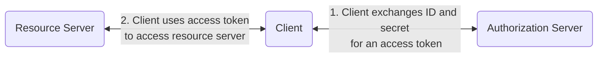
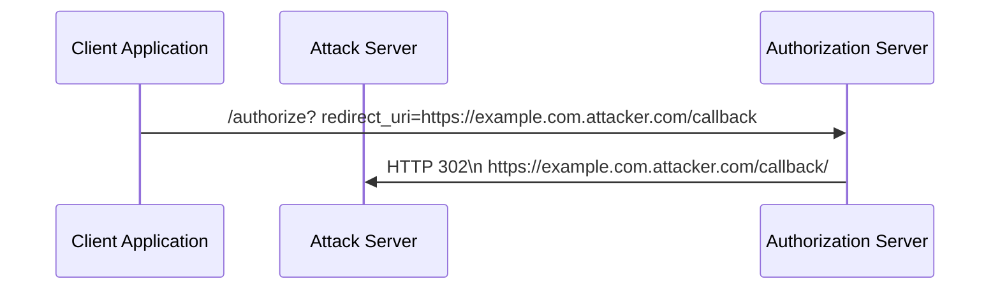

# Authentication System Security

<!-- TODO: break this up into multiple different files and link them here, similar to how we do the vimrc file -->

<https://github.com/michaelawyu/auth-server-sample>

## Tool Versions

| Tool | Description | Version |
| ---- | ----------- | ------- |
| Python | Language used | 3.10.2

## Tool Setup

### Rancher

### Docker

### Docker-Compose

### Python

## Best Practices

## OAuth 2.0

[Authorization Code Flows](./docs/authz-code-flows.md)

#### Resource Owner Password Credentials

#### Implicit

#### Client Credentials

## Attack Scenarios

### Improper Redirect URI

