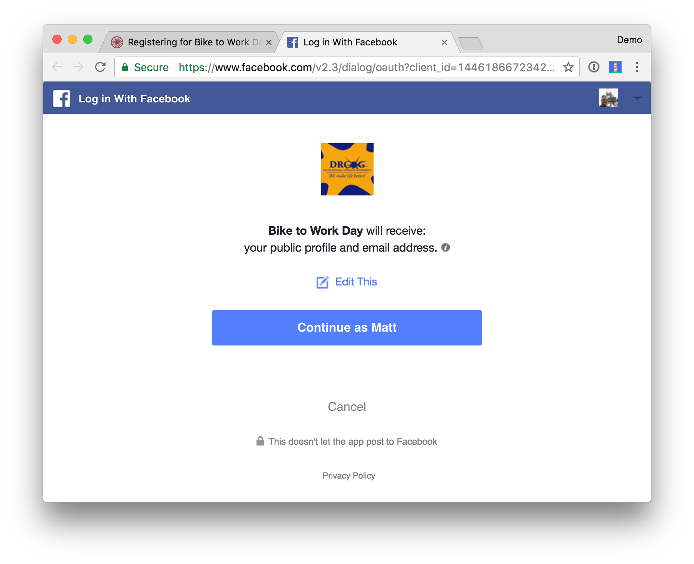

# History and Background

- November 2006 - Blaine Cook and Chris Messina (Twitter), David Recordon, Larry Halff, & more (CitizenSpace)
  - No open standard for API access delegation
- April 2007 - Google group created to write a proposal for an open protocol. Group joined by Dewitt Clinton
- October 3, 2007 - OAuth Core 1.0 final draft released

## What is OAuth?

- Open Authorization
- Website A leveraging functioanlity from Website B often need the data that Website B has about you.
- OAuth removes the requirement for Users to give Website A secret information about Website B
- Allows the **User** to grant private access to resources on one site (**Service Provider**) to another site (**Consumer**)

## OAuth 1.0 vs 2.0

## OpenID vs OAuth

- OpenID - Single Identity to sign on to many sites (SSO)
- OAuth - Giving access to your stuff without sharing all the secret parts of your identity
  - *Not* an OpenID extension
- They do not depend on each other
