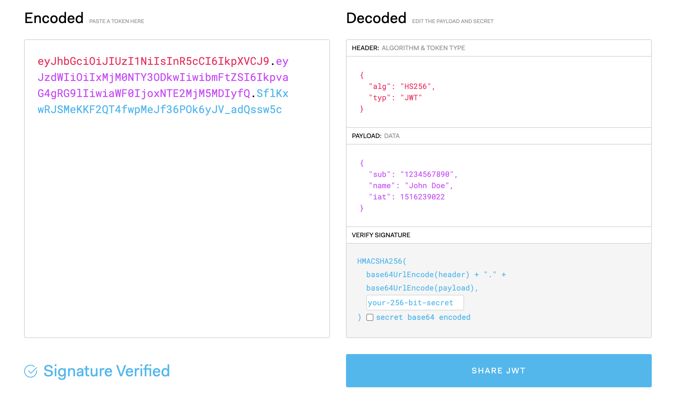

# How Does It Work?

1. App requests authorization from a User
2. User authorizes App and delivers proof
3. App presents proof of authorization to server to get a Token
4. Token is restricted to only access to what the User authorized for the specific App

## Actors

- **Resource Owner**: Owner of the data the application wants to access.
  - Usually, this is data about the User. You are the **Resource Owner** of your Facebook profile
- **Resource Server** (API): API that stores data the application wants to access
- **Client**: Application that wants to access your data from another site
- **Authorization Server**: Main engine behind OAuth

## Workflow Revisited

1. **Client** requests authorization from a **Resource Owner**
2. **Resource Owner** authorizes **Client**
3. **Client** presents proof of authorization to **Resource Server**
4. Token is restricted to only allow access to what the **Resource Owner** authorized for the specified **Client**

## Tokens

- **Access Tokens**
  - Tokens mentioned above that the **Client** uses to access the **Resource Server**.
  - Intentionally short-lived
  - Designed to scale out
  - Can't be revoked
- **Refresh Tokens**
  - Alive for days, months, or years.
  - Can be used to get new tokens
  - Applications typically require confidential clients with authentication
  - Can be revoked

### JSON Web Tokens

The OAuth spec doesn't define what a token is. Technically, it can be whatever you want.

[JWTs](<https://jwt.io/>)

JSON Web Tokens are the current standard.

- Can digitally sign information
- Can be verified at a later time with a secret signing key
