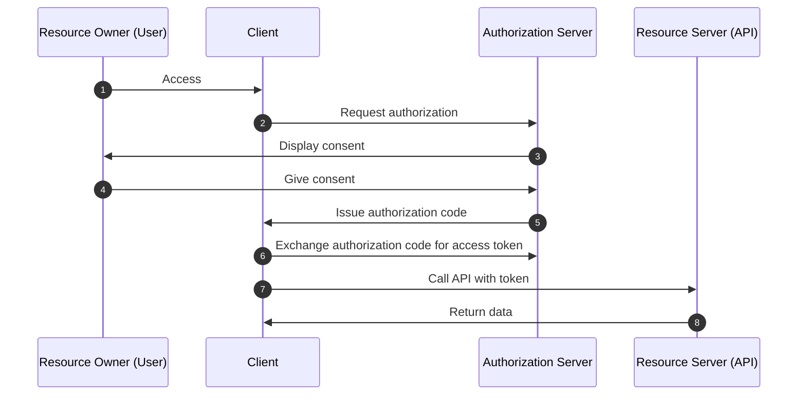
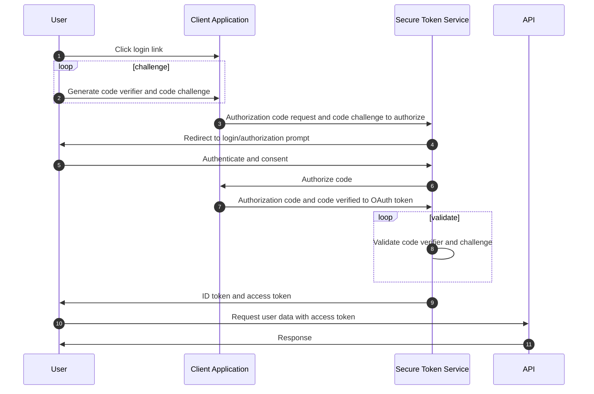

# OAuth Flows

Unordered list of different OAuth 2 Flows

- Implicit Flow
- Authorization Code Flow
- Authorization Code Flow with Private Key for Code Exchange Extension (PKCE)
- Client Credential Flow
- Resource Owner Password Flow
- Assertion Flow
- Device Flow (not included in OAuth 2.0 Spec)

## Implicit Flow (2-Legged OAuth)

- All communication happens through the browser - no backend server redeeming the authorization grant for an access token
- Optimized for browser-only public clients
- Access token returned directly from the authroization request
- Typically doesn't support refresh tokens
- Assumes **Resource Owner** and **Public Client** are on the same device
- Most vulnerable to security threats

## Authorization Code Flow (3-Legged OAuth)

- Gold standard
- Assumes **Resource Owner** and **Client** application are on separate devices

High Level

Application opens a browser to send the User to the OAuth server
User sees the authorization prompto and approves the app's request
User is redirected back to the application with an authorization code in a query string
Application exchanges the authorization code for an access token

### Requirements

- **Client** must be able to interact with a user agent (browser)

### Flow

1. **Resource Owner** accesses the **Client** via a User Agent (web browser). **Client** triggers OAuth flow
2. Client prepares a link to the **Authorization Server** and sends the **Resource Owner** to the **Authorization Server** by opening a browser to that URL
3. **Authorization Server** presents a prompt asking if the **Resource Owner** would like to authorize the **Client**'s request
4. **Resource Owner** gives consent.
5. If approved, the **Authorization Server** redirects the browser back to the redirect_uri specified by the **Client**, and issues the authorization code to the Client
6. **Client** application makes a POST request to the Authorization Server, and exchanges the Authorization Code for an Access Token
7. **Client** uses the Access Token to access resources from the **Resource Server**
8. **Resource Server** returns data to the **Client** applicaiton.

### Authorization Code PKCE

PKCE extends the Oauth 2.0 framework, and adds additional security and allows public clients to perform the authorization code flow

PKCE RFC: <https://tools.ietf.org/html/rfc7636>

- Access token Is never placed in a URL
- Access Token can be concealed from user agent
- Confidential Clients identify themselves with a Client Secret

- Let's public clients use the Authorization Code flow rather than the implicit flow, even though they can't secure a client secret
- Mitigates the impact of a compromised Authorization Code by a malicious actor

#### Requirements

#### Flow

