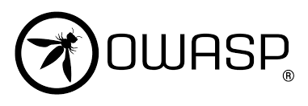
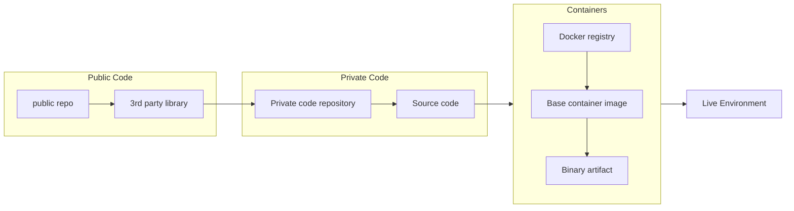

# Challenges

## OAuth 2.0 Threats

### Compromised Access Token

Can be used to request protected resources from the **Resource Server**

#### In Practice

- User falls victim to XSS attack (or otherwise has the access token leaked)
- Attacker can perform any action on behalf of the victim

### Compromised Authorization Code

Can be used to integrate the victim's third party account with the attacker's client account

#### In Practice

- Attacker uses **Client Application** normally
- Starting with Authorization Code Flow up to step 3
- Attacker replaces their Authorization Code with the victim's, then continues the flow
- Victim's third party account (**Resource Server**) is integrated with the attacker's **Client Account**

### Compromised Client Secret

Attacker can impersonate the **Client Application**

#### In Practice

- Allows attacker to directly exchange Authorization Codes for Access Tokens
  - Significantly increases impact of compromised Authorization Code
- Attacker creates a malicious phishing **Client Application** and target other users
- Malicious phishing client uses legitimate Client ID and Secret. Indistinguishable from the legitimate client to the authorization server
- **Authorization Server** struggles to identify and properly revoke client secret, because it was also used by the legitimate client

## General Web Application Security

### OWASP

<https://owasp.org/www-project-web-security-testing-guide/>

### Supply Chain

