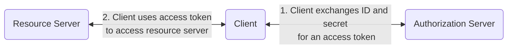

# Attacks

## CSRF

Entice a victim user to browse a Client URL that contains the Access Token or Authorization Code of the attacker, integrating the attackers account

Most of the time this scenario is benign, but context can increase risk.

Scenario - user has integrated their paypal account with the client, which they use to withdraw money from the Paypal account

If CSRF was possible, the attacker could integrate their own paypal account with the victims Client account.

## Clickjacking

## XSS

### URI Redirect

#### Fix
